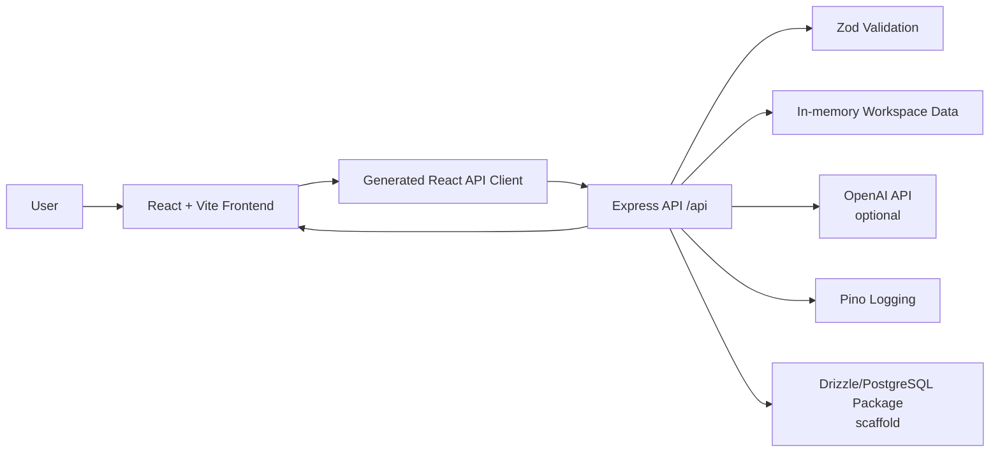

# 🚀 DevFlow AI

DevFlow AI is a full-stack developer workspace prototype for organizing projects, tasks, team activity, and AI-assisted project questions in one interface. The repository is structured as a pnpm monorepo with a React/Vite frontend, an Express API server, shared API schemas generated around an OpenAPI contract, and a Drizzle/PostgreSQL database package scaffold. It is designed as a foundation for a developer collaboration product and currently focuses on dashboard, project, task, activity, settings, and Copilot experiences rather than a complete production SaaS platform.

> **Current implementation note:** The repository contains working frontend/API flows, but some infrastructure is still scaffolded. Project and task data are currently held in server memory, authentication is not implemented, and the database schema package does not yet define application tables. The AI Copilot can use OpenAI when `OPENAI_API_KEY` is configured and otherwise falls back to deterministic workspace-aware responses.

## ✨ Features

### Workspace dashboard
- Overview of project and task activity.
- Productivity and task-completion charts.
- Upcoming deadlines and recent activity.
- GitHub-style activity cards using the workspace's current API data.
- Workspace insights displayed in the dashboard.

### 📁 Project management
- List projects with status filtering.
- Create projects.
- Update project details.
- Delete projects.
- Project progress and task statistics are calculated from the current task collection when available.

### ✅ Task management
- List tasks.
- Filter tasks by status and project.
- Create tasks.
- Update tasks.
- Assign a task to a named assignee.
- Track status, priority, due date, labels, comments count, and estimate.

### 🕒 Activity tracking
- Workspace activity is recorded for project and task changes.
- Recent activity can be retrieved through the API and displayed in the Activity page.

### 🤖 DevFlow Copilot
- Dedicated Copilot interface in the frontend.
- Answers questions about the current workspace.
- Supports workspace questions such as overdue work, priorities, review bottlenecks, and next-work suggestions.
- Uses current project/task/activity context when calling OpenAI.
- Returns answer text together with source labels and suggested actions.
- Falls back to deterministic, workspace-aware answers when no OpenAI key is configured or the provider request fails.

### 🎨 Modern frontend
- React + TypeScript application built with Vite.
- Shared application shell with sidebar/navigation.
- Responsive UI styling with Tailwind CSS.
- Reusable UI primitives based on Radix UI.
- Charts powered by Recharts.
- Form handling with React Hook Form and Zod integration.
- Toast notifications and error boundaries.
- Client-side routing with Wouter.
- React Query for server-state fetching/caching.

### 🔌 API contract
- Express 5 backend.
- OpenAPI 3.1 specification under `lib/api-spec`.
- Shared Zod schemas under `lib/api-zod`.
- Generated React API client package under `lib/api-client-react`.
- Request validation is performed through the shared Zod schemas.

## 🧠 AI Capabilities

DevFlow Copilot is the repository's implemented AI feature.

### Model/API
When `OPENAI_API_KEY` is present, the API server calls the OpenAI Chat Completions API using the `gpt-4o-mini` model.

The request is made server-side from:

`artifacts/api-server/src/routes/workspace.ts`

### Workspace-aware context
The API builds a context object containing current:

- Projects
- Tasks
- Recent activity

That context is included in the Copilot system message so the model is instructed to answer from the available workspace data and to be explicit when the data is insufficient.

### Deterministic fallback
Without `OPENAI_API_KEY`, Copilot does not call an external AI provider. Instead, the API evaluates the user's message against the current in-memory workspace data and provides grounded responses for supported questions, including:

- Overdue tasks
- Next/prioritized work
- Review queue
- General workspace status

If an OpenAI request fails, the server logs the failure and returns the deterministic workspace response instead.

### What is not implemented yet
The current repository does **not** contain evidence of:

- RAG or document retrieval
- Vector database/vector embeddings
- AI agents
- Tool-calling workflows
- Conversation persistence
- Streaming AI responses
- Authentication-aware AI authorization

These should be treated as future extensions rather than current features.

## 🛠️ Tech Stack

| Technology | Purpose |
|---|---|
| React | Frontend UI |
| TypeScript | Type-safe application and API code |
| Vite | Frontend development/build tooling |
| Wouter | Client-side routing |
| TanStack React Query | Server-state/data fetching |
| Tailwind CSS | Styling |
| Radix UI | Accessible UI primitives |
| Recharts | Dashboard charts |
| React Hook Form | Form handling |
| Zod | Request/response validation and schemas |
| Express 5 | Backend API server |
| PostgreSQL | Database target/scaffold |
| Drizzle ORM | Database access layer/scaffold |
| OpenAPI 3.1 | API contract |
| Orval | API client/code-generation tooling referenced by the workspace documentation |
| Pino / pino-http | Server logging |
| esbuild | API server bundling |
| pnpm workspaces | Monorepo/package management |

> PostgreSQL and Drizzle are present as database infrastructure, but application tables are not currently defined and the workspace routes currently use in-memory data.

## 🏗️ System Architecture

The repository uses a workspace/monorepo structure that separates the frontend, API server, shared API contracts, and database package.



### Request flow

1. The user interacts with the React application.
2. Wouter selects the requested frontend page.
3. React Query/API client handles API communication.
4. Requests reach the Express server under `/api`.
5. Shared Zod schemas validate request and response data.
6. Workspace routes read or mutate the current in-memory project/task/activity state.
7. Copilot requests optionally call OpenAI with workspace context.
8. The API returns structured JSON to the frontend.
9. The frontend renders the result.

## 📂 Project Structure

```text
DevFlow-AI/
├── artifacts/
│   ├── api-server/
│   │   ├── src/
│   │   │   ├── app.ts
│   │   │   ├── index.ts
│   │   │   ├── lib/
│   │   │   │   └── logger.ts
│   │   │   ├── middlewares/
│   │   │   └── routes/
│   │   │       ├── health.ts
│   │   │       ├── index.ts
│   │   │       └── workspace.ts
│   │   ├── build.mjs
│   │   ├── package.json
│   │   └── tsconfig.json
│   │
│   ├── devflow-ai/
│   │   ├── public/
│   │   │   ├── favicon.svg
│   │   │   └── robots.txt
│   │   ├── src/
│   │   │   ├── App.tsx
│   │   │   ├── main.tsx
│   │   │   ├── index.css
│   │   │   ├── components/
│   │   │   │   ├── devflow-ui.tsx
│   │   │   │   ├── error-boundary.tsx
│   │   │   │   └── ui/
│   │   │   ├── hooks/
│   │   │   ├── lib/
│   │   │   └── pages/
│   │   │       ├── activity.tsx
│   │   │       ├── assistant.tsx
│   │   │       ├── dashboard.tsx
│   │   │       ├── not-found.tsx
│   │   │       ├── projects.tsx
│   │   │       ├── settings.tsx
│   │   │       └── tasks.tsx
│   │   ├── components.json
│   │   ├── index.html
│   │   ├── package.json
│   │   ├── tsconfig.json
│   │   └── vite.config.ts
│   │
│   └── mockup-sandbox/
│
├── lib/
│   ├── api-client-react/
│   ├── api-spec/
│   │   └── openapi.yaml
│   ├── api-zod/
│   └── db/
│       ├── drizzle.config.ts
│       ├── src/
│       │   ├── index.ts
│       │   └── schema/
│       │       └── index.ts
│       ├── package.json
│       └── tsconfig.json
│
├── scripts/
├── attached_assets/
├── .gitignore
├── .npmrc
├── .replit
├── .replitignore
├── package.json
├── pnpm-lock.yaml
├── pnpm-workspace.yaml
├── replit.md
├── tsconfig.base.json
└── README.md
```

### Important directories

- `artifacts/devflow-ai` — React/Vite frontend application.
- `artifacts/api-server` — Express backend and API routes.
- `lib/api-spec` — OpenAPI source contract.
- `lib/api-zod` — shared Zod API schemas/types.
- `lib/api-client-react` — generated/client-side API package.
- `lib/db` — Drizzle/PostgreSQL database package scaffold.
- `scripts` — workspace scripts.
- `attached_assets` — repository asset location; no application screenshots were identified in the current tree.

## ⚙️ Installation

### Prerequisites

- Node.js 24 or a compatible Node.js version supported by the workspace.
- pnpm.
- An OpenAI API key only if you want live OpenAI-powered Copilot responses.
- PostgreSQL is only needed once the database package is connected to real application data; the current routes do not require a database connection to run their in-memory data.

### 1. Clone the repository

```bash
git clone https://github.com/naveenchhipa350/devflow-ai.git
```

### 2. Enter the project directory

```bash
cd devflow-ai
```

### 3. Install dependencies

This repository is configured to use **pnpm**. The root `preinstall` script rejects other package managers.

```bash
pnpm install
```

### 4. Environment variables

The current API server reads one optional environment variable:

```env
OPENAI_API_KEY=your_openai_api_key_here
```

If the variable is omitted, the Copilot endpoint uses its built-in deterministic workspace response.

### 5. Database setup

The repository includes a Drizzle/PostgreSQL package with a `push` script:

```bash
pnpm --filter @workspace/db run push
```

However, the current database schema is only a scaffold and does not define application tables yet. The current workspace API therefore operates on in-memory data rather than persisted PostgreSQL records.

### 6. Run the frontend

From the repository root:

```bash
pnpm --filter @workspace/devflow-ai run dev
```

The Vite server is configured to listen on `0.0.0.0`. Vite normally exposes the development application at:

```text
http://localhost:5173
```

Check the terminal output for the exact port if Vite selects a different one.

### 7. Run the API server

In a second terminal:

```bash
pnpm --filter @workspace/api-server run dev
```

The repository documentation configures the API server for port `5000`.

The API base path is:

```text
/api
```

For example, the health endpoint is:

```text
http://localhost:5000/api/healthz
```

## 🔐 Environment Variables

| Variable | Required | Description |
|---|---|---|
| `OPENAI_API_KEY` | No | OpenAI API key used by the server-side DevFlow Copilot integration. Without it, Copilot falls back to deterministic workspace responses. |
| `DATABASE_URL` | Not currently used by the application routes | The repository documentation identifies this as the PostgreSQL connection string for the Drizzle database package, but the current database schema is still a scaffold. |

> Never commit real API keys or database credentials to Git.

## 🎯 How It Works

### Dashboard

1. The frontend loads the dashboard route.
2. The frontend API layer requests `/api/dashboard`.
3. The Express workspace router builds a dashboard response from the current in-memory projects, tasks, activity, and GitHub-style activity data.
4. Zod validates the response.
5. The dashboard renders cards, charts, deadlines, activity, and insights.

### Projects and tasks

1. A user opens Projects or Tasks.
2. The frontend requests the corresponding API endpoint.
3. The API validates query/body data with shared Zod schemas.
4. The server reads or modifies its in-memory collections.
5. An activity record is added for relevant create/update/delete operations.
6. The structured response is returned to the frontend.

### Copilot

1. The user enters a question in DevFlow Copilot.
2. The frontend sends the message to `POST /api/copilot/messages`.
3. The API validates the request.
4. The server creates a grounded response from current workspace data.
5. If `OPENAI_API_KEY` exists, the server sends the workspace context and user question to `gpt-4o-mini` through OpenAI's Chat Completions API.
6. If the provider succeeds, its answer is returned along with workspace source labels/actions.
7. If the provider is unavailable or fails, the grounded fallback response is returned.

## 🧩 API Documentation

The API is mounted under `/api`.

| Method | Endpoint | Description | Authentication |
|---|---|---|---|
| GET | `/api/healthz` | Server health check | None implemented |
| GET | `/api/dashboard` | Get workspace dashboard data | None implemented |
| GET | `/api/projects` | List projects; optional `status` filter | None implemented |
| POST | `/api/projects` | Create a project | None implemented |
| PATCH | `/api/projects/:id` | Update a project | None implemented |
| DELETE | `/api/projects/:id` | Delete a project | None implemented |
| GET | `/api/tasks` | List tasks; optional `status` and `projectId` filters | None implemented |
| POST | `/api/tasks` | Create a task | None implemented |
| PATCH | `/api/tasks/:id` | Update a task | None implemented |
| GET | `/api/activity` | List recent workspace activity | None implemented |
| POST | `/api/copilot/messages` | Ask DevFlow Copilot | None implemented |

The source API contract is available at [`lib/api-spec/openapi.yaml`](./lib/api-spec/openapi.yaml).

### Example: health check

```bash
curl http://localhost:5000/api/healthz
```

Expected shape:

```json
{
  "status": "ok"
}
```

### Example: ask Copilot

```bash
curl -X POST http://localhost:5000/api/copilot/messages \
  -H "Content-Type: application/json" \
  -d '{"message":"What work should I prioritize?"}'
```

Response shape:

```json
{
  "answer": "...",
  "sources": ["Task queue", "Project status"],
  "actions": ["Open task queue", "View project health"]
}
```

## 🖥️ Screenshots / Demo

No dedicated application screenshots, GIFs, or demo videos were identified in the current repository tree.

<!-- Add application screenshots here -->

<!-- Example once screenshots are added:

-->

## 🧪 Testing

No dedicated automated test suite or test framework was identified in the current repository structure.

The repository does provide TypeScript validation commands:

```bash
pnpm run typecheck
```

Frontend typecheck:

```bash
pnpm --filter @workspace/devflow-ai run typecheck
```

API typecheck:

```bash
pnpm --filter @workspace/api-server run typecheck
```

These commands check types; they are not substitutes for automated unit or end-to-end tests.

## 🚀 Deployment

The repository contains Replit-oriented configuration files and a Vite frontend plus a separately bundled Express API. No complete production deployment configuration was identified for a specific cloud platform.

### Build the workspace

```bash
pnpm run build
```

The root build script performs typechecking and then runs package build scripts where available.

### Frontend build

```bash
pnpm --filter @workspace/devflow-ai run build
```

### API build

```bash
pnpm --filter @workspace/api-server run build
```

### Production considerations

Before deploying this project as a production SaaS application, configure:

- A persistent PostgreSQL database and real application schema.
- A production-safe `DATABASE_URL`.
- `OPENAI_API_KEY` as a server-side secret when AI functionality is enabled.
- Authentication and authorization.
- Persistent storage instead of in-memory project/task/activity arrays.
- CORS rules appropriate for the production frontend domain.
- Production logging and monitoring.

## 🔒 Security

The current implementation includes several useful foundations:

- API requests are validated with Zod schemas.
- The OpenAI API key is read server-side from `process.env` rather than exposed in the React client.
- Express uses JSON/urlencoded body parsing and CORS middleware.
- Pino is used for structured HTTP/server logging.
- The API returns 404 responses for missing project/task resources.

### Current security limitations

Authentication and authorization are **not implemented** in the current repository. API endpoints are therefore not protected by user identity or workspace permissions.

The current in-memory data model also means data is not persistent or isolated between authenticated users because authentication does not yet exist.

## ⚡ Performance

The codebase includes some practical frontend/backend foundations:

- TanStack React Query is used for client-side server-state management.
- Vite provides a fast development/build pipeline.
- esbuild bundles the API server.
- API responses are schema-validated before being returned.
- Pino provides lightweight structured logging.

No production-scale caching, database indexing strategy, background jobs, streaming responses, or performance benchmarking was identified in the current implementation.

### Future performance improvements

- Persist data in PostgreSQL and add appropriate indexes.
- Add pagination for larger project/task/activity collections.
- Add server-side caching where useful.
- Stream AI responses where appropriate.
- Add performance monitoring and profiling.

## 🛣️ Roadmap

### Completed

- [x] pnpm monorepo structure
- [x] React + Vite frontend
- [x] Express API server
- [x] Dashboard page
- [x] Projects page and project CRUD API
- [x] Tasks page and task create/update/list API
- [x] Activity page and activity API
- [x] Settings page
- [x] DevFlow Copilot UI
- [x] Optional OpenAI Copilot integration
- [x] Deterministic Copilot fallback
- [x] OpenAPI API specification
- [x] Shared Zod API validation
- [x] Drizzle/PostgreSQL package scaffold
- [x] TypeScript typechecking
- [x] Error boundary and toast UI foundations

### Planned

- [ ] Add real authentication and session management
- [ ] Add role-based authorization
- [ ] Define real PostgreSQL/Drizzle application tables
- [ ] Persist projects, tasks, and activity in PostgreSQL
- [ ] Connect the frontend to persistent data end-to-end
- [ ] Add real GitHub OAuth/API integration instead of static GitHub-style activity data
- [ ] Add persistent conversations for Copilot
- [ ] Add RAG/document retrieval if required by the product
- [ ] Add automated unit/integration/end-to-end tests
- [ ] Add production deployment configuration
- [ ] Add monitoring and error tracking

## 🤝 Contributing

Contributions are welcome.

1. Fork the repository.
2. Create a feature branch:

```bash
git checkout -b feature/your-feature-name
```

3. Make your changes.
4. Run typechecking/build checks.
5. Commit your changes:

```bash
git commit -m "Add your feature"
```

6. Push the branch:

```bash
git push origin feature/your-feature-name
```

7. Open a Pull Request with a clear description of the change.

## 📄 License

This repository declares the **MIT License** in the root `package.json`.

If a separate `LICENSE` file is added later, keep this section synchronized with that file.

## 👨‍💻 Author

**Naveen Chhipa**

- GitHub: [@naveenchhipa350](https://github.com/naveenchhipa350)

## ⭐ Why DevFlow AI?

DevFlow AI is technically interesting because it combines a modern TypeScript frontend with a separately structured Express API, shared OpenAPI/Zod contracts, a database package scaffold, and a server-side AI integration. The current project demonstrates practical full-stack concepts including component-based UI development, client/server separation, API design, request validation, state management, error handling, logging, and AI-assisted workspace functionality. Its architecture also provides a clear path toward adding persistent storage, authentication, authorization, real-time collaboration, GitHub integration, and more advanced AI workflows.

## 📌 Important Notes

- The repository is a **pnpm workspace**, not a single Next.js application.
- The frontend is **React + Vite**, not Next.js.
- The backend is **Express 5** and is packaged separately from the frontend.
- The current workspace data in `workspace.ts` is stored in memory, so changes are lost when the API server restarts.
- The Drizzle/PostgreSQL package exists, but `lib/db/src/schema/index.ts` currently contains only schema scaffolding and no application tables.
- There is currently no implemented authentication/authorization layer.
- The Copilot integration is optional and requires `OPENAI_API_KEY` for live OpenAI responses.
- The current Copilot implementation uses the OpenAI Chat Completions endpoint with `gpt-4o-mini` and falls back to local deterministic responses when the provider is unavailable.
- The repository contains `replit.md` and Replit-related configuration, but no complete production deployment configuration was identified.
- No dedicated screenshots/demo assets were identified in the current repository tree.
- Keep API keys and database credentials out of Git and configure them through the deployment environment.
